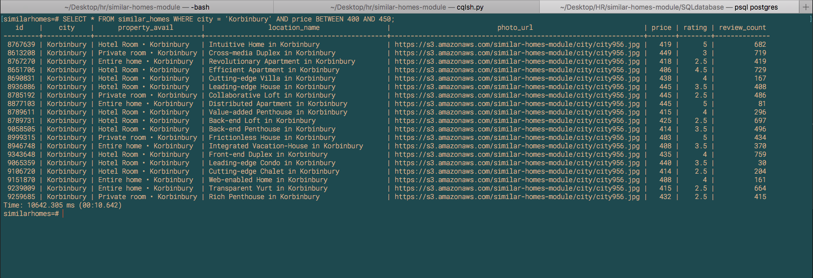
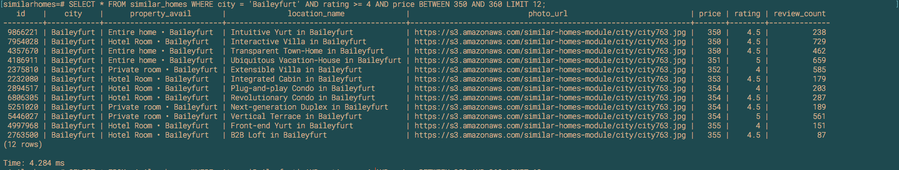
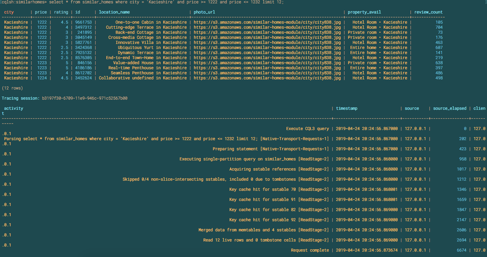
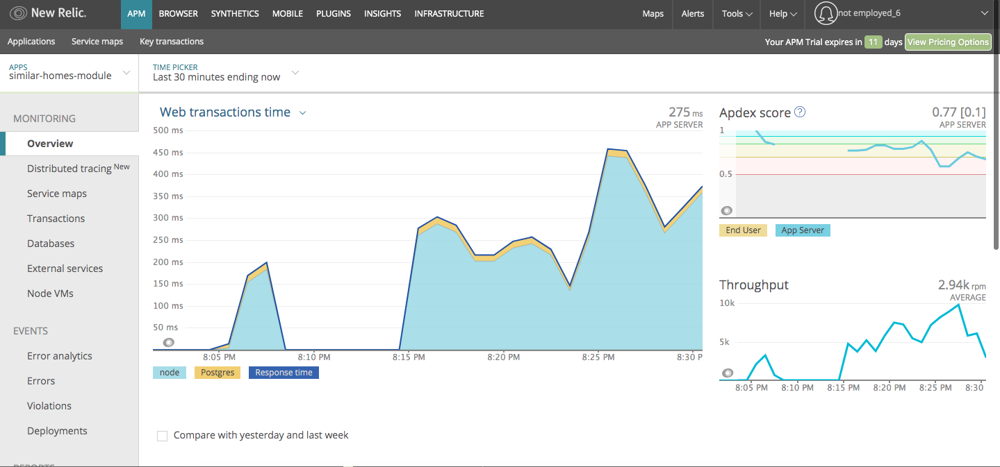

# Similar Homes Module

The similar homes module from Abode.ly was scaled and deployed through AWS EC2 instances to meet web-scale demand. An RDBMS(PostgreSQL) and a NoSQL DBMS(Apache Cassandra) was compared for optimal query speeds and their abilities to bulk load data in a timely manner. PostgreSQL was decided because a complex query was required and time constraint. Cassandra is known to be quick for reads but setting up clusters that allow for a complex query for more than two columns would take a significant amount of time. 

## Initial Comparisions

### PostgreSQL

### Cassandra

Only allowed a two column query with a single cluster sort

### K6 Local testing & New Relic AWS testing

## CRUD API

_________________________________________________________________________
| Endpoint                         | Type   | Operation                 |
|----------------------------------|--------|---------------------------|
| `/similarhomes/:host_id/nearby`  | GET    | Get related listing       |
| `/similarhomes/:host_id/nearby`  | POST   | Add a related listing     |
| `/similarhomes/:host_id/nearby`  | PATCH  | Update a related listing  |
| `/similarhomes/:host_id/nearby`  | DELETE | Delete a related listing  |
_________________________________________________________________________